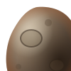

<p align="center">
  
</p>

# Deimos

**DIA Expression Integrated Multi-Omics Suite**

Complete LFQ DIA proteomics pipeline — from a DIA-NN matrix to an interactive dashboard.

Designed for LC-MS/MS DIA workflows on TIMS-TOF (Bruker). Compatible with any experimental design.

---

## Features

- Quality control (detection frequency, missing values, inter-sample correlation)
- Filtering and imputation (QRILC / Mixed MNAR+MAR) with automatic missingness diagnostic
- Differential analysis: **limma** + **DEqMS** (peptide-count weighting)
- Robustness score via repeated stochastic imputation (parallelised)
- FDR correction per contrast or globally (BH)
- Visualisations: volcano plots, PCA, UMAP, heatmaps, UpSet, scatter plots
- Co-expression: **WGCNA** (modules, hub scores, trait correlation)
- Functional enrichment: **GO/KEGG** via gProfiler
- Multi-sheet Excel export + interactive HTML dashboard
- Reusable YAML configuration — no interactive prompts after the first run

---

## Input files

| File | Required | Description |
|---|---|---|
| `report.pg_matrix.tsv` | ✅ | Protein × sample matrix (DIA-NN v2.5+) |
| `ExperimentalDesign.csv` | ✅ | Columns: `label;condition;replicate` (separator `;`) |
| `report.pr_matrix.tsv` | ⬜ | Precursor matrix (enables DEqMS) |

---

## Installation

```bash
pip install -r requirements.txt
```

Or manually:

```bash
pip install pandas numpy scipy scikit-learn umap-learn matplotlib seaborn \
  adjustText openpyxl pillow PyComplexHeatmap pyyaml gprofiler-official
```

**Dashboard offline** — place `chart.umd.min.js` and `xlsx.full.min.js` alongside `build_dashboardv7.py`:
- https://cdn.jsdelivr.net/npm/chart.js@4.4.1/dist/chart.umd.min.js
- https://cdn.jsdelivr.net/npm/xlsx@0.18.5/dist/xlsx.full.min.js

---

## Usage

```bash
# Interactive mode (prompted at startup)
python deimos.py

# YAML config mode — no prompts
python deimos.py --config config_example.yaml

# Interactive + save config for future runs
python deimos.py --save-config

# Override a path without editing the config
python deimos.py --config project.yaml --tsv /data/run2/report.pg_matrix.tsv
```

---

## Repository structure

```
deimos-proteomics/
├── deimos.py                   # Main orchestrator
├── config.py                   # Reusable YAML config management
├── config_example.yaml         # Annotated YAML template
├── limma_ebayes.py             # Statistical engine (limma + DEqMS)
├── go_enrichment.py            # GO/KEGG enrichment (gProfiler)
├── dashboard_integration.py    # Excel → dashboard bridge
├── build_dashboardv7.py        # HTML dashboard generator
├── dashboard_template.html     # Dashboard template
├── diagnostic_dashboard.py     # Dashboard diagnostic utility
├── deimos_mark.svg             # Deimos icon (dashboard nav)
├── requirements.txt
├── LICENSE
└── example_data/               # Minimal synthetic dataset
    ├── report.pg_matrix.tsv
    └── ExperimentalDesign.csv
```

---

## Output

```
proteomics_output/
├── ProteomicAnalysis_Results.xlsx   # Full multi-sheet report
├── proteogen_dashboard.html         # Interactive dashboard
└── last_config.yaml                 # Last run config (reloadable)
```

**Excel sheets**: Methods_Upstream · Methods · raw_data · Log2_Impute · QC · PCA_UMAP · UMAP · Scatter_Plots · Differential_Expression · Volcano_Plots · UpSet_Intersections · Zscore_Heatmap · ANOVA_Results · ANOVA_Clusters · WGCNA_* · GO_*

---

## YAML configuration

Copy `config_example.yaml` and adapt:

```yaml
volcano_use_padj:    false   # true = FDR (p.adj), false = raw p-value
volcano_p_thresh:    0.05
volcano_ratio_min:   1.5     # linear ratio (e.g. 1.5 = 50% change)

anova_use_padj:      false
anova_p_thresh:      0.05
n_heatmap_clusters:  3

n_iter_robustness:   100     # 0 = disabled
fdr_global:          false   # true = BH correction across all p-values
impute_method:       qrilc   # 'qrilc' or 'mixed'

go_organism:         null    # e.g. hsapiens, mmusculus, bnapus — null = disabled
make_wgcna:          false
make_dashboard:      true
use_deqms:           false
```

---

## Name

**Deimos** — moon of Mars, small and precise.  
Acronym: **D**IA **E**xpression **I**ntegrated **M**ulti-**O**mics **S**uite.

---

## License

MIT — see [LICENSE](LICENSE).
