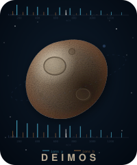

<p align="center">
  
</p>

# Deimos

**DIA Expression Integrated Multi-Omics Suite**

Complete LFQ DIA proteomics pipeline — from a DIA-NN matrix to an interactive dashboard.

Designed for LC-MS/MS DIA workflows on TIMS-TOF (Bruker). Compatible with any experimental design.

---

## Features

- Quality control (detection frequency, missing values, inter-sample correlation)
- Filtering and imputation (QRILC / Mixed MNAR+MAR) with automatic missingness diagnostic
- Differential analysis: **limma** + **DEqMS** (peptide-count weighting), with an automatic
  reliability diagnostic (variance~peptide-count relationship) that disables DEqMS on runs
  where its premise doesn't hold, rather than silently returning misleading results
- Automatic detection of the **control condition** (`ctl`, `ctrl`, `control`, `wt`, `mock`...),
  systematically placed as the denominator in every contrast (`treated_vs_control`, never the
  reverse) — overridable with an explicit name if it doesn't match a standard synonym
- Optional **batch correction**, controlled as a covariate in the statistical model (not a naive
  matrix correction reused for testing), with a before/after PCA diagnostic (Kruskal-Wallis + ε²)
- Automatic **multi-organism detection** (UniProt-style `_TAG` suffix in `Protein.Names`, e.g.
  host + pathogen), with optional per-organism analysis
- Robustness score via repeated stochastic imputation (parallelised)
- FDR correction per contrast or globally (BH)
- Visualisations: volcano plots, PCA, UMAP, heatmaps, UpSet, scatter plots
- Co-expression: **WGCNA** (modules, hub scores, trait correlation)
- Functional enrichment: **GO/KEGG** via gProfiler, with an automatic **coverage diagnostic**
  (g:Convert) that checks whether your organism is actually well indexed *before* running the
  enrichment — if not, it offers to go through **Perseverance** (bundled in this repository):
  orthologous proteins in a well-annotated reference species are found by Reciprocal Best Hit
  (DIAMOND), the real gProfiler is queried on that reference species, and results are mapped
  back to your original protein IDs
- Multi-sheet Excel export + interactive HTML dashboard, with a **light/dark theme toggle**
- Reusable YAML configuration — no interactive prompts after the first run

---

## Input files

| File                     | Required | Description                                          |
| ------------------------ | -------- | ----------------------------------------------------- |
| `report.pg_matrix.tsv`   | ✅        | Protein × sample matrix (DIA-NN v2.5+)               |
| `ExperimentalDesign.csv` | ✅        | Columns: `label;condition;replicate[;subject]` (separator `;`) |
| `report.pr_matrix.tsv`   | ⬜        | Precursor matrix (enables DEqMS)                     |
| Two FASTA files          | ⬜        | Your search FASTA + a reference proteome — only if using Perseverance |

---

## Installation

```bash
pip install -r requirements.txt
```

Or manually:

```bash
pip install pandas numpy scipy scikit-learn umap-learn matplotlib seaborn \
  adjustText openpyxl pillow PyComplexHeatmap pyyaml gprofiler-official
```

Optional, only if using **Perseverance** (orthology search):

```bash
sudo apt install diamond-aligner   # or: conda install -c bioconda diamond
```

**Dashboard offline** — place `chart.umd.min.js` and `xlsx.full.min.js` alongside `build_dashboardv7.py`:

- <https://cdn.jsdelivr.net/npm/chart.js@4.4.1/dist/chart.umd.min.js>
- <https://cdn.jsdelivr.net/npm/xlsx@0.18.5/dist/xlsx.full.min.js>

(If absent, the dashboard falls back to loading both from cdnjs.cloudflare.com.)

---

## Usage

```bash
# Interactive mode (prompted at startup)
python deimos.py

# YAML config mode — no prompts
python deimos.py --config config_example.yaml

# Interactive + save config for future runs
python deimos.py --save-config

# Override a path without editing the config
python deimos.py --config project.yaml --tsv /data/run2/report.pg_matrix.tsv
```

The statistical engine (`limma_ebayes.py`) is a Python reimplementation of `limma::eBayes`/DEqMS
— **no dependency on R**. Validated numerically against the real R `limma`/`DEqMS` (machine
precision on eBayes).

---

## Repository structure

```
deimos-proteomics/
├── deimos.py                     # Main orchestrator
├── config.py                     # Reusable YAML config management
├── config_example.yaml           # Annotated YAML template
├── limma_ebayes.py                # Statistical engine (limma + DEqMS, design matrix, contrasts)
├── go_enrichment.py                # GO/KEGG enrichment (gProfiler), local ORA, coverage diagnostic
├── gsea_enrichment.py               # Rank-based GSEA
├── dashboard_integration.py         # Excel -> dashboard bridge
├── build_dashboardv7.py              # HTML dashboard generator
├── dashboard_template.html           # Dashboard template (light/dark theme)
├── diagnostic_dashboard.py            # Dashboard diagnostic utility
├── deimos_mark.svg / deimos_icon.svg  # Deimos icons
├── perseverance.py                    # Orthology search CLI (RBH via DIAMOND)
├── rbh.py / transfer.py                # Perseverance internals
├── deimos_to_perseverance.py            # Deimos <-> Perseverance bridge (FASTA, ID mapping)
├── README_PERSEVERANCE.md                # Perseverance-specific documentation
├── requirements.txt
├── LICENSE
└── example_data/                          # Minimal synthetic dataset
    ├── report.pg_matrix.tsv
    └── ExperimentalDesign.csv
```

---

## Output

```
proteomics_output/
├── ProteomicAnalysis_Results.xlsx   # Full multi-sheet report
├── proteogen_dashboard.html         # Interactive dashboard (light/dark toggle)
└── last_config.yaml                 # Last run config (reloadable)
```

**Excel sheets**: Methods_Upstream · Methods · raw_data · Log2_Impute · QC · PCA_UMAP · UMAP ·
Scatter_Plots · Differential_Expression · Volcano_Plots · UpSet_Intersections · Zscore_Heatmap ·
ANOVA_Results · ANOVA_Clusters · WGCNA_* · GO_* · Orthologues_Perseverance (if orthology mode was used)

---

## YAML configuration

Copy `config_example.yaml` and adapt. Beyond the standard statistical thresholds, the most useful
options added recently:

```yaml
use_deqms:            false     # DEqMS, gated by the automatic reliability diagnostic
deqms_force:          false     # force DEqMS even if the diagnostic is unfavourable

control_condition:    "__auto__"  # "__auto__" (auto-detect), an explicit name, or false (disabled)
batch_column:         null        # column of ExperimentalDesign.csv to control as a covariate

go_organism:          null        # gProfiler species code (e.g. "bnapus"), null = disabled
run_perseverance:     "__auto__"  # "__auto__" (asks at runtime), true/false
perseverance_reference_organism: null  # gProfiler code of the well-annotated reference species

make_wgcna:           false
make_dashboard:       true
```

Any extra YAML key is passed through to the pipeline even if not listed in `config.py`'s
defaults — no code change needed to use a parameter already read via `params.get(...)`.

---

## Ecosystem

| Tool | Role |
|---|---|
| **Deimos** (this repo) | Full DIA quantitative pipeline |
| [Phobos](https://github.com/BenoitBe/phobos-peptidomics-pipeline) | DDA/PEAKS peptidomics + PTM pipeline |
| [Pathfinder](https://github.com/BenoitBe/Pathfinder) | Cross-contrast synthesis across several Deimos/Phobos runs, no recomputation |
| **Perseverance** | Orthology search (RBH/DIAMOND) for non-model organisms — bundled directly in this repository, see `README_PERSEVERANCE.md` |

---

## Name

**Deimos** — moon of Mars, small and precise.
Acronym: **D**IA **E**xpression **I**ntegrated **M**ulti-**O**mics **S**uite.

---

## License

MIT — see [LICENSE](LICENSE).
