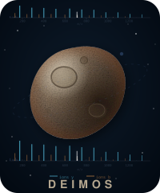

<p align="center">
  
</p>

# Deimos

**DIA Expression Integrated Multi-Omics Suite**

Complete LFQ DIA proteomics pipeline — from a DIA-NN matrix to an interactive dashboard.

Designed for LC-MS/MS DIA workflows on TIMS-TOF (Bruker). Compatible with any experimental design.

---

## Features

- **Quality control**: detection frequency, missing values, inter-sample correlation, RLE plot
  (diagnostic only — no re-normalisation after DIA-NN)
- **Filtering and imputation** with an automatic missingness diagnostic:
  - `impute_method: auto` (default) — MIXED if ≥ 20 % of missing values are MAR, QRILC otherwise;
    the choice and its justification are written to the Methods sheet
  - QRILC as in Lazar *et al.* (2016): mean and SD of the left-censored distribution estimated
    by quantile regression, not from the observed values alone
  - fixed random **seed** (`seed: 42` by default): two runs on the same input give the same
    p-values; the seed is recorded in Methods
- **Differential analysis**: **limma** + **DEqMS** (peptide-count weighting), with an automatic
  reliability diagnostic (variance~peptide-count relationship) that disables DEqMS on runs
  where its premise doesn't hold, rather than silently returning misleading results
- **Experimental design handling**:
  - automatic detection of the **control condition** (`ctl`, `ctrl`, `control`, `wt`, `mock`...),
    systematically placed as the denominator (`treated_vs_control`, never the reverse) —
    overridable with an explicit name
  - **contrast selection** (`contrasts`): all pairs by default, or explicit patterns such as
    `Live_{s}_vs_Heat_killed_{s}` (same value on both sides) or `Live_*_vs_Live_*`
  - **paired designs** (`subject` column): model `~0 + condition + subject` when a subject spans
    ≥ 2 conditions
  - **pseudo-replication check**: warning (console + Methods) when a subject has several samples in
    the same condition — those samples are not independent replicates. Warning only: the model is
    not modified
  - optional **batch covariate** (`batch_column`), modelled in the design (not a matrix correction
    reused for testing), with a before/after PCA diagnostic (Kruskal-Wallis + ε²)
- **QC-only mode** (`qc_only` / `--qc-only`), enabled automatically when no condition has a
  replicate: raw data, Methods and QC figures, no statistics
- Automatic **multi-organism detection** (UniProt-style `_TAG` suffix in `Protein.Names`, e.g.
  host + pathogen), with optional per-organism analysis
- **Robustness score** via repeated stochastic imputation (parallelised), using the same imputation
  method as the reference run, with seeds derived from `seed`
- FDR correction per contrast or globally (BH)
- Visualisations: volcano plots, PCA, UMAP (skipped below 5 samples), heatmaps, UpSet, scatter plots
- Co-expression: **WGCNA** (modules, hub scores, trait correlation)
- **Functional enrichment** (GO / KEGG / Reactome), two backends:
  - **gProfiler** (`go_backend: gprofiler`, default), with an automatic **coverage diagnostic**
    (g:Convert). If the organism is poorly indexed, Deimos offers **Perseverance** (bundled):
    orthologues in a well-annotated reference species are found by Reciprocal Best Hit (DIAMOND),
    gProfiler is queried on that species, and results are mapped back to your protein IDs
  - **STRING** (`go_backend: string`) — recommended for bacteria and non-model organisms. The
    species is identified by NCBI taxid, detected automatically from UniProt accessions
    (`go_species_taxid: auto`). If the strain itself is not indexed in STRING, Deimos switches to
    an **orthology mode** (RBH with DIAMOND against the STRING proteome of the parent species).
    Background: whole genome (default) or quantified proteins (`string_background: quantified`,
    recommended when only a small fraction of the proteome is quantified)
  - ORA per ANOVA heatmap cluster (`Cluster_Enrich_N` sheets)
  - optional rank-based **GSEA** (`run_gsea: true`, `gseapy`, Enrichr gene-set libraries)
- Multi-sheet Excel export + interactive HTML dashboard, with a **light/dark theme toggle**
- Reusable YAML configuration

---

## Input files

| File                     | Required | Description                                          |
| ------------------------ | -------- | ----------------------------------------------------- |
| `report.pg_matrix.tsv`   | ✅        | Protein × sample matrix (DIA-NN ≥ 2.5)               |
| `ExperimentalDesign.csv` | ✅        | Columns: `label;condition;replicate` (separator `;`), optionally `subject` and a batch column |
| `report.pr_matrix.tsv`   | ⬜        | Precursor matrix (enables DEqMS)                     |
| Two FASTA files          | ⬜        | Your search FASTA + a reference proteome — only for Perseverance |
| Search FASTA             | ⬜        | STRING orthology mode: query sequences (otherwise fetched from UniProt) |

`label` must match exactly the sample name read from each DIA-NN column: the `Sple-…` token of
the run name (from `Sple-` up to the next `_`), or the full column name if there is none.
Recognised subject columns: `subject`, `pair`, `patient`, `individual`. Other names (`animal`,
`donor`, `mouse`...) trigger a warning asking you to rename the column.

---

## Installation

```bash
pip install -r requirements.txt
```

Or manually:

```bash
pip install pandas numpy scipy scikit-learn umap-learn matplotlib seaborn \
  adjustText openpyxl pillow PyComplexHeatmap pyyaml gprofiler-official
```

Optional:

```bash
pip install gseapy                  # rank-based GSEA (run_gsea: true)
sudo apt install diamond-aligner    # or: conda install -c bioconda diamond
                                    # needed by Perseverance and by the STRING orthology mode
```

Enrichment needs network access to the gProfiler, STRING and UniProt APIs.

**Dashboard offline** — place `chart.umd.min.js` and `xlsx.full.min.js` alongside `build_dashboardv7.py`:

- <https://cdn.jsdelivr.net/npm/chart.js@4.4.1/dist/chart.umd.min.js>
- <https://cdn.jsdelivr.net/npm/xlsx@0.18.5/dist/xlsx.full.min.js>

(If absent, the dashboard falls back to loading both from cdnjs.cloudflare.com.)

---

## Usage

```bash
# Interactive mode (prompted at startup)
python deimos.py

# YAML config mode
python deimos.py --config config_example.yaml

# Interactive + save config for future runs
python deimos.py --save-config

# Override paths or options without editing the config
python deimos.py --config project.yaml --tsv /data/run2/report.pg_matrix.tsv --out-dir /data/run2/out
python deimos.py --config project.yaml --batch-column batch
python deimos.py --config project.yaml --qc-only
```

**Unattended runs** (scheduler, cluster, no terminal): two options still ask a question at runtime
when left on `"__auto__"`, and the run stops with `EOFError` if nobody can answer —
`run_perseverance` (asked at every run) and `contrasts` (asked above 30 contrasts). Set both
explicitly in the YAML (`config_example.yaml` sets `run_perseverance: false`).

Check a paired design before running: `python check_paired.py ExperimentalDesign.csv`.

The statistical engine (`limma_ebayes.py`) is a Python reimplementation of `limma::eBayes`/DEqMS
— **no dependency on R**. It was checked against R `limma`/`DEqMS` during development; the
comparison scripts and reference outputs are not yet included in this repository.

---

## Reproducibility

- `seed` fixes the reference imputation draw and the robustness iterations.
- The Methods sheet records the imputation method (and why `auto` chose it), the seed, the design
  matrix, the selected contrasts and the design checks.
- `last_config.yaml` in the output folder reloads the exact configuration of the last run.

---

## Repository structure

```
deimos-proteomics-pipeline/
├── deimos.py                     # Main orchestrator
├── config.py                     # YAML config management, CLI arguments
├── config_example.yaml           # Annotated YAML template
├── limma_ebayes.py               # Statistical engine (limma + DEqMS, design matrix, contrasts)
├── go_enrichment.py              # GO/KEGG enrichment: gProfiler, STRING, local ORA, coverage diagnostic
├── gsea_enrichment.py            # Rank-based GSEA
├── dashboard_integration.py      # Excel -> dashboard bridge
├── build_dashboardv7.py          # HTML dashboard generator
├── dashboard_template.html       # Dashboard template (light/dark theme)
├── diagnostic_dashboard.py       # Dashboard diagnostic utility
├── check_paired.py               # Pre-flight check of a paired design
├── check_gsea.py                 # GSEA integration diagnostic
├── perseverance.py               # Orthology search CLI (RBH via DIAMOND)
├── rbh.py / transfer.py          # Perseverance internals
├── deimos_to_perseverance.py     # Deimos <-> Perseverance bridge (FASTA, ID mapping)
├── README_PERSEVERANCE.md        # Perseverance documentation
├── README_INTEGRATION.md         # Perseverance <-> Deimos integration notes
├── deimos_mark.svg / deimos_icon.svg
├── CHANGELOG.md
├── requirements.txt
├── LICENSE
└── example_data/                 # Minimal synthetic dataset (smoke test, no biological signal)
    ├── report.pg_matrix.tsv
    └── ExperimentalDesign.csv
```

---

## Output

```
proteomics_output/
├── ProteomicAnalysis_Results.xlsx   # Full multi-sheet report
├── ProteomicAnalysis_QC.xlsx        # QC-only mode (instead of the above)
├── proteogen_dashboard.html         # Interactive dashboard (light/dark toggle)
├── string_orthologs/                # STRING orthology mode: proteome cache + DIAMOND files
└── last_config.yaml                 # Last run config (reloadable)
```

**Excel sheets** (full mode): Methods_Upstream · Methods · raw_data · Log2_Impute · QC · PCA_UMAP ·
UMAP · Scatter_Plots · Differential_Expression · Volcano_Plots · UpSet_Intersections ·
Zscore_Heatmap · ANOVA_Results · ANOVA_Clusters, plus depending on the options: WGCNA_* · GO_* ·
Cluster_Enrich_* · GSEA_* · Orthologues_Perseverance · Orthologues_STRING

**QC-only mode**: Methods_Upstream · Methods · raw_data · Log2 (not imputed) · QC · PCA_Correlation
(complete cases, ≥ 3 samples)

---

## YAML configuration

Copy `config_example.yaml` and adapt; every key is documented there. The keys that most often
change between projects:

```yaml
impute_method:        auto        # auto | qrilc | mixed
seed:                 42          # reproducible imputation

contrasts:            "__auto__"  # "__auto__", "all", or a list of patterns:
#  - "Live_{s}_vs_Heat_killed_{s}"   # {x} = same value on both sides
#  - "Live_*_vs_Live_*"              # *   = any value

control_condition:    "__auto__"  # "__auto__" (auto-detect), an explicit name, or false
batch_column:         null        # column of ExperimentalDesign.csv modelled as a covariate
use_deqms:            false       # DEqMS, gated by the automatic reliability diagnostic

go_organism:          null        # gProfiler species code (e.g. "bnapus"), null = disabled
go_backend:           gprofiler   # gprofiler | string
go_species_taxid:     null        # STRING: "auto" or an NCBI taxid
string_background:    genome      # genome | quantified
run_perseverance:     "__auto__"  # "__auto__" (asks at runtime), true/false

qc_only:              false
make_wgcna:           false
make_dashboard:       true
```

Any extra YAML key is passed through to the pipeline even if not listed in `config.py`'s
defaults — no code change needed to use a parameter already read via `params.get(...)`. The
flip side: a misspelt key is ignored without error.

---

## Ecosystem

| Tool | Role |
|---|---|
| **Deimos** (this repo) | Full DIA quantitative pipeline |
| [Phobos](https://github.com/BenoitBe/phobos-peptidomics-pipeline) | DDA/PEAKS peptidomics + PTM pipeline |
| [Pathfinder](https://github.com/BenoitBe/Pathfinder) | Cross-contrast synthesis of a Deimos/Phobos report (core signature, meta-GO, WGCNA cross-reading), no recomputation |
| **Perseverance** | Orthology search (RBH/DIAMOND) for non-model organisms — bundled directly in this repository, see `README_PERSEVERANCE.md` |

---

## Name

**Deimos** — moon of Mars, small and precise.
Acronym: **D**IA **E**xpression **I**ntegrated **M**ulti-**O**mics **S**uite.

---

## License

MIT — see [LICENSE](LICENSE).
